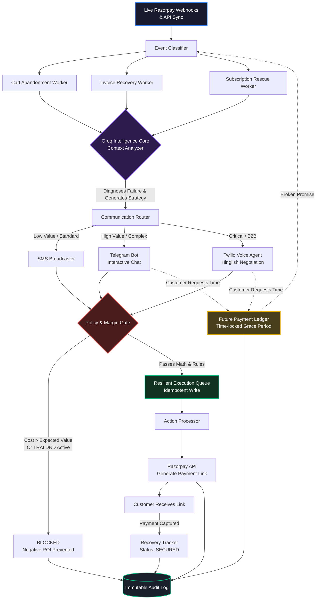

# 🛡️ RevenueGuard: Autonomous Margin-Aware Recovery Engine


**Live Demo:** [https://revenue-gurad-gamma-one-78.vercel.app/](https://revenue-gurad-gamma-one-78.vercel.app/)

RevenueGuard is a highly sophisticated, AI-driven recovery system designed to autonomously rescue failed payments, abandoned carts, and overdue invoices. Unlike standard retry scripts, RevenueGuard uses **Neural Networks (brain.js)** to predict the Expected Value (EV) of a recovery attempt, and routes it through a **Groq-powered Intelligence Core** for multi-channel negotiation (Voice, Telegram, SMS)—ensuring that the cost of recovery never exceeds the value of the transaction.

---

## 🌟 Core Features

| Feature | Description | Technical Implementation |
|---------|-------------|--------------------------|
| **🧠 Margin & EV Predictor** | Calculates the Expected Value (ROI) before attempting recovery to prevent negative margins. | Uses a `brain.js` neural network trained on 5,000 synthetic logs to predict success probabilities, choosing the optimal channel by calculating `EV = (Probability × Amount) - Cost`. |
| **🤖 Groq Intelligence Core** | Context-aware router that diagnoses *why* a payment failed and generates a recovery strategy. | Leverages Groq's high-speed LLMs to analyze Razorpay webhooks and dispatch dynamic, localized payloads (e.g., Hinglish for Voice). |
| **📞 Multi-Agent Negotiation** | Reaches out to customers on the optimal channel based on friction and value. | Integrates **Twilio Voice AI** for high-value B2B calls, **Telegram Bots** for interactive chat, and **SMS** for standard alerts. |
| **🛑 Policy & Compliance Gate** | Ensures strict regulatory compliance and mathematical profitability. | Blocks actions if TRAI DND is active, if the attempt is outside allowed hours, or if the API cost exceeds the Expected Value. |
| **🛡️ Resilient Execution Queue** | Guarantees that actions are executed reliably, exactly once, even during crashes. | Implements the **Transactional Outbox Pattern** with Idempotency Keys in a SQLite database. |
| **🔒 Immutable Audit Log** | Tamper-evident system of record for every AI decision and generated Razorpay link. | Hashes every action with **SHA-256 Cryptography** to ensure compliance and traceability. |

---

## 🏗️ System Architecture

The following diagram illustrates the complete, fault-tolerant lifecycle of a failed Razorpay event processed by RevenueGuard:



---

## 🚀 Getting Started

Follow these instructions to clone the repository and run RevenueGuard on your local machine.

### 1. Clone the Repository
```bash
git clone https://github.com/UTshresth/revenue-guard.git
cd revenue-guard
```

### 2. Backend Setup (Port 3001)
The backend is a Node.js/Express server that runs the ML Neural Network, SQLite Database, and API routes.

```bash
cd backend
npm install

# Create a .env file and add your keys (see Environment Variables section)
touch .env

# Start the backend server
node server.js
```
*The backend will automatically start on `http://localhost:3001` and train the neural network on boot.*

### 3. Frontend Setup (Port 3000)
The frontend is a modern Next.js 14 application styled with Tailwind CSS.

```bash
# Open a new terminal window
cd frontend
npm install

# Start the Next.js development server
npm run dev
```
*The frontend will be available at `http://localhost:3000`.*

---

## 🔐 Environment Variables

To run the full suite of AI and communication tools, create a `.env` file in your `backend` directory with the following keys:

```env
# Server
PORT=3001
FRONTEND_URL=http://localhost:3000

# Razorpay API (For fetching webhooks & generating links)
RAZORPAY_KEY_ID=your_key_id
RAZORPAY_KEY_SECRET=your_key_secret
RAZORPAY_WEBHOOK_SECRET=your_webhook_secret

# AI Models
GROQ_API_KEY=your_groq_api_key

# Communication Channels
TWILIO_ACCOUNT_SID=your_twilio_sid
TWILIO_AUTH_TOKEN=your_twilio_token
TWILIO_PHONE_NUMBER=your_twilio_phone

TELEGRAM_BOT_TOKEN=your_telegram_bot_token
```

---

## 🧪 Testing the Margin & EV Predictor
To test the `brain.js` neural network:
1. Navigate to the Dashboard on `localhost:3000`.
2. Click on the **Margin & EV Predictor** block.
3. Adjust the Transaction Amount, Friction Score, and Delay parameters.
4. Watch the AI dynamically calculate the Expected Value for Voice, Telegram, and SMS, and actively Block negative ROI actions!
