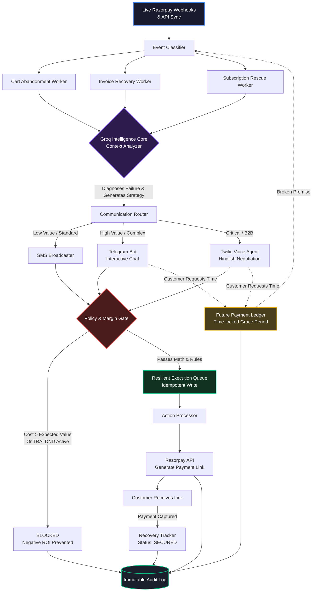

# 🛡️ RevenueGuard: Autonomous Margin-Aware Recovery Engine


**Live Demo:** [https://revenue-gurad-gamma-one-78.vercel.app/](https://revenue-gurad-gamma-one-78.vercel.app/)

RevenueGuard is a highly sophisticated, AI-driven recovery system designed to autonomously rescue failed payments, abandoned carts, and overdue invoices. Unlike standard retry scripts that blindly spam customers, RevenueGuard acts as an **Intelligent Recovery Agent**. It evaluates the Expected Value (EV) of every failed transaction, negotiates dynamically across multiple communication channels (Voice, Telegram, SMS), and logs every decision into a cryptographically secure, tamper-proof Audit Trail.

---

## 🌟 Core Architecture & Features

| Component | Description | Technical Implementation |
|-----------|-------------|--------------------------|
| **🤖 Groq Intelligence Core (Recovery Agent)** | Context-aware LLM router that diagnoses *why* a payment failed and dynamically negotiates recovery. | Leverages Groq's high-speed inference to analyze Razorpay webhooks and generate localized, conversational payloads (e.g., Hinglish for Voice calls). |
| **🔒 Immutable Audit Trail** | Tamper-evident system of record for every AI decision, compliance check, and generated Razorpay link. | Hashes every automated action with **SHA-256 Cryptography** to ensure strict regulatory compliance and traceability. |
| **🧠 Margin & EV Predictor** | Calculates the Expected Value (ROI) before attempting recovery to prevent negative profit margins. | Uses an ML Neural Network trained on thousands of historical recoveries to predict success probabilities and choose the optimal channel. |
| **📞 Multi-Channel Negotiation** | Reaches out to customers dynamically on the optimal channel based on friction and transaction value. | Integrates **Twilio Voice AI** for high-value complex calls, **Telegram Bots** for interactive chat, and **SMS** for standard alerts. |
| **🛑 Policy & Compliance Gate** | Ensures strict regulatory compliance (e.g. TRAI) and mathematical profitability. | Blocks actions if TRAI DND is active, if the attempt is outside allowed hours, or if the communication API cost exceeds the Expected Value. |
| **🛡️ Resilient Execution Queue** | Guarantees that actions are executed reliably, exactly once, preventing double-billing. | Implements the **Transactional Outbox Pattern** with Idempotency Keys in a SQLite database to survive system crashes. |

---

## 🔍 Deep Dive: How the Core Features Work

### 🤖 1. The Autonomous Recovery Agent (Groq Intelligence Core)
At the heart of RevenueGuard is an autonomous agent powered by Groq's lightning-fast LLM inference. When a Razorpay webhook fires for a failed payment, the agent intercepts the payload, analyzes the root cause (e.g., Insufficient Funds vs. Network Timeout), and formulates a highly personalized recovery strategy. It doesn't just send a link; it *negotiates*. If a customer needs time, it sets up a "Time-locked Grace Period" (Future Payment Ledger) and follows up automatically.

### 🔒 2. The Immutable Audit Trail (SHA-256)
When AI is handling money, trust and transparency are paramount. Every single decision made by the Recovery Agent—whether it's generating a new Razorpay link, sending an SMS, or blocking an action due to compliance—is recorded into our Audit Ledger. Each entry is sealed with a **SHA-256 Cryptographic Hash**. This ensures that the history of automated financial interactions is tamper-proof and fully compliant with financial regulations. 

### 🧠 3. Margin-Aware ML Predictor (Expected Value)
Blindly calling every failed transaction is expensive. RevenueGuard features a lightweight Neural Network that predicts the exact Expected Value (EV) of a recovery attempt before it happens. 
- It calculates: `EV = (Probability of Recovery × Transaction Amount) - API Cost of Channel`
- If a failed payment is only worth ₹50, but a Twilio Voice call costs ₹15 with a low chance of success, the ML Predictor **blocks** the action, saving the merchant money and protecting their margins.

### 📞 4. Multi-Channel Routing
The system dynamically selects the cheapest, most effective channel to recover the payment:
*   **Twilio Voice AI:** Used for high-value (₹10,000+) B2B transactions. The AI speaks to the customer in Hinglish, diagnoses the issue, and secures a verbal Promise-to-Pay.
*   **Telegram Bot:** Used for interactive, mid-value B2C negotiations where the customer might need to select an alternative payment method.
*   **Standard SMS:** Used for low-friction, low-value drop-offs (e.g., quick cart abandonment).

### 🛡️ 5. Resilient Execution (Outbox Pattern)
Financial systems cannot afford to double-charge customers or drop events during server restarts. RevenueGuard implements a robust **Transactional Outbox Pattern**. Actions are securely written to the database with a unique `idempotency_key` before they are executed. If the server crashes mid-process, the Dispatcher Worker automatically resumes pending actions without duplicating messages.

---

## 🏗️ System Architecture Flowchart

The following diagram illustrates the complete, fault-tolerant lifecycle of a failed Razorpay event processed by RevenueGuard:



---

## 🚀 Getting Started

Follow these instructions to clone the repository and run RevenueGuard on your local machine.

### 1. Clone the Repository
```bash
git clone https://github.com/UTshresth/revenue-guard.git
cd revenue-guard
```

### 2. Backend Setup (Port 3001)
The backend is a Node.js/Express server that runs the ML Neural Network, SQLite Database, and API routes.

```bash
cd backend
npm install

# Create a .env file and add your keys (see Environment Variables section)
touch .env

# Start the backend server
node server.js
```
*The backend will automatically start on `http://localhost:3001` and initialize the ML Predictor on boot.*

### 3. Frontend Setup (Port 3000)
The frontend is a modern Next.js 14 application styled with Tailwind CSS.

```bash
# Open a new terminal window
cd frontend
npm install

# Start the Next.js development server
npm run dev
```
*The frontend will be available at `http://localhost:3000`.*

---

## 🔐 Environment Variables

To run the full suite of AI and communication tools, create a `.env` file in your `backend` directory with the following keys:

```env
# Server
PORT=3001
FRONTEND_URL=http://localhost:3000

# Razorpay API (For fetching webhooks & generating links)
RAZORPAY_KEY_ID=your_key_id
RAZORPAY_KEY_SECRET=your_key_secret
RAZORPAY_WEBHOOK_SECRET=your_webhook_secret

# AI Models
GROQ_API_KEY=your_groq_api_key

# Communication Channels
TWILIO_ACCOUNT_SID=your_twilio_sid
TWILIO_AUTH_TOKEN=your_twilio_token
TWILIO_PHONE_NUMBER=your_twilio_phone

TELEGRAM_BOT_TOKEN=your_telegram_bot_token
```
